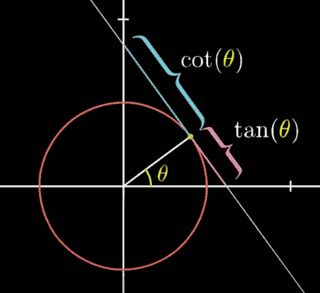

# Trigonometry fundamentals | Lockdown math ep. 2

```
cos(x)² = (1+cos(2x)) /2
```

In particular the one thing I want you to take note of is the weird fact that, when you sqaure cos, it's not equal to but it's somewhat related to the idea of scaling up that intput

```
cos(x)² ←→  cos(2x)
```

Now if you were clever there is another function that behaves very similarly to this

```
f(x) = 2ˣ
```

Maybe, just maybe cosine is somehow related to exponents. It's not at all obvious how it is , but it absolutely is. 


**Trigonometry Basis**: **You think its about triangles, but really it's about circles.**


Here, θ is the input, and it's going to be a measure of how far you've walked around a unit circle.  sin(θ) give you the y-axis value -- the distance between you and the x-axis.


By contrast consine is defined very similarly but it's giving you the x coordinat. 

----

```
cos(x)² + sin(x)² = 1 
```

If fact this is equivalent to the Pythagorean theorem(勾股定理).

But you never see it written down like that. 

Because people don't want to write too many paranthesis , instead they write 

```
cos²(x) + sin²(x) = 1 
```

How lovely we don't have to write too many symbols, what a wonderful convention except for the fact that literally every other time in math you see something written as `f²(x)`, what that means is not `(f(x))²` ,that's almost never what it means.

instead what it's supposed to mean for most of math is taking a function and applying it to itself `f(f(x))` . 

THe idea is that it's very different from the convention in trigonometry. Trigonometry is just flying by its own rules: I understand some students will be confused but I'm trigonometry I don't care. 

---

Now we will walk back to the very beginning , associated with cos²(θ) and cos(2θ). 

```
cos(x)² = (1+cos(2x)) /2
```

cos²(x) which looks like little scaled-down version of cosine, oscillating more quickly is the same as cos(2x) that quicker oscillation, but we had to kind of shift it and rescale it to make them equal. 

what is the cos(π/12) ?

We'll find next time is that this is actually a shadow of the fact that trigonometric functions are related to complex numbers. 

And the idea of doubling the angle (cos(2x))  correspoinding to multiplying by something twice (cos²(x)) not at all a coincidence. 

**Where is tan(θ) ?** 



It actually lies tangent to the circle, so is where the word "tan" comes from. 

**Where is cos²(θ) ?**

If draw the graph of cos(x) and cos²(x) simultaneously 


