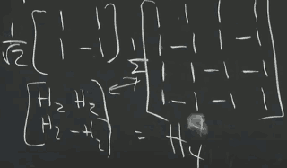
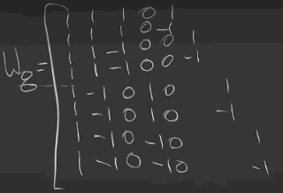

# 1. The Column Space of A Contains All Vectors Ax

```
A =

    2    1    3
    3    1    4
    5    7   12
```

We can easily figure out that the column vectors are dependent. But what's about the row vectors? Can you find out the linear combination which leads to 0 ?

A = CR

```
C =

   2   1
   3   1
   5   7
```

```
R =

   1   0   1
   0   1   1
```

Now we get a basis of the row space , and can easily figure out the linear combination.

## AxB

- beginner way
    - *row of A*  · *col of B*
- deeper way
    - Σ *col of A* x *row of B*
    - sum of rank-1 matrices
    - Quiz: 
    - Idea: 
        - pulling off a rank-1 matrix
        - the rest has 0s in the 1st row and col
    - Ans: 

# 2. Multiplying and Factoring Matrices

- A = LU  , elimination
- A = QR
- S = QΛQᵀ  , symmetric matrix, real eigen values Λ, orthogonal eigen vectors Q
    - = λ₁·q₁·q₁ᵀ + ... + λ<sub>n</sub>·qλ<sub>n</sub>·qλ<sub>n</sub>ᵀ  (spectral theorem)
    - Sq₁ = λ₁·q₁
- A = XΛX⁻¹  , Not symmetric
- A = UΣVᵀ  ,  A is not square


# 3. Orthonormal Columns in Q Give QᵀQ = I

## Householder Reflections Matrix

- start with a unit vector uᵀu = 1
- H = I - 2uuᵀ
- HᵀH = I - 4uuᵀ + 4uuᵀuuᵀ = I
    - H is orthogonal matrix
    - H is symmetric

## Hadamard Matrix




## Wavelets


self-scaling



Eigenvector of S=Sᵀ , QᵀQ=I are orthogonal.

Eigenvetor of Q = 

```
Q =

   0   1   0   0
   0   0   1   0
   0   0   0   1
   1   0   0   0
```

are 4x4 Fourier Discrete Transform .

Does this work for any Q ?


# 4. Eigenvalues and Eigenvectors

When I say *positive definite*, I mean symmetric.

- if x is a eigenvector of A , then 
    - Aᵏx = λᵏx
    - A⁻¹x = 1/λ · x
- how about any vector v ?
    - split into the linear combination of eigenvectors:
    - v = c₁x₁ + ... + c<sub>n</sub>x<sub>n</sub>
    - Aᵏv = c₁λ₁ᵏx₁ + ... + c<sub>n</sub>λ<sub>n</sub>ᵏx<sub>n</sub>
- solving problems:
    - v<sub>k+1</sub> = Av<sub>k</sub>
    - dv/dt = Av
- similar matrix
    - B = M⁻¹AM
    - A and B have the same eigenvalues
- AB has the same non-zero eigenvalue as BA
    - M=B ,so that B⁻¹(BA)B = AB 
- for 2x2 matrix, we can get the eigen values quickly through trace and determinant.


# 5. Positive Definite and Semidefinite Matrices

There are symmetric matrices that have positive eigenvalues.

How to know whether a symmetric matrix is positive definite or not ?

- 5 ways to test
    1. All λᵢ > 0
    2. Energy xᵀSx > 0 (all x≠0)
        - this is what **deep learning** is about
        - this could be a loss function that you **minimize**
            - in practice, it generally be  xᵀSx + xᵀb
    3. S = AᵀA  ( independent cols in A)
    4. All leading determinants > 0
        - leading means 1x1, 2x2, ... , nxn
    5. All pivots in dlimination > 0

- Sum of positive definite matrix is still positive definite
    - tips: calculate the energy
- inverse of positive definte matrix is still positive definite
    - eigenvalues of S⁻¹: 1/λ


# 6. Singular Value Decomposition (SVD)

- AᵀA is symmetric, positive definite
- Looking for a set of orthogonal vectors v, so that when I multiply them by A, I get a bunch of orthogonal vectors u.
    - Av₁ = σ₁u₁
    - ...
    - Avᵣ = σᵣuᵣ  , this is what takes the place of Ax = λx
- that is , **orthogonal vs in row space** -> **orthogonal us in column space**
    - AV = ΣU  , A = UΣVᵀ
- AᵀA = VΣᵀUᵀUΣVᵀ = V(ΣᵀΣ)Vᵀ  (form of eigenvector factorization)
    - V : eigenvectors of AᵀA
    - σ²: eigenvalues of AᵀA
- AAᵀ = UΣVᵀVΣᵀUᵀ = U(ΣΣᵀ)Uᵀ
    - I'm not going to use this step so much since we can get u directly from v
    - uᵣ = Avᵣ/σᵣ
        - Proof: u₁ᵀu₂ = (Av₁/σ₁)ᵀ(Av₂/σ₂) = (v₁ᵀAᵀ·Av₂)/(σ₁σ₂) = (v₁ᵀ·σ₂²·v₂)/(σ₁σ₂) = 0
- **the heart of the thing: the non-zero eigenvalues of AᵀA and AAᵀ are same.**
- In practice how would we actually find them ? You would not go the AᵀA route since it's too much computation for big matrix ???
- The SVD is telling us something quite remarkable: that every linear transformation, every matrix, factors into a rotation times a stretch times a different rotation. 
- Another factorization of A that is famous in engineering and geometry
    - Polar Decomposition : A = SQ
    - every matrix factors into a symmetric matrix times a orthogonal matrix.
    - We can get S,Q quickly out of SVD.
        - A = UΣVᵀ = A = UΣUᵀUVᵀ
        - S = UΣUᵀ , Q = UVᵀ

# 7. Eckart-Young Theorom: The Closest Rank k Matrix to A

- PCA  principal component analysis
- We have a big matrix, we want to get the important information, not all the information.
- The important information are in its larget k singular values.
    - A<sub>k</sub> = σ₁u₁v₁ᵀ + ... +  σ<sub>k</sub>u<sub>k</sub>v<sub>k</sub>ᵀ
    - A<sub>k</sub> uses the first k pieces of the SVD, is the best approximation to A of rank k.
- To measure how big a matrix is : norm of A 
    - ‖A‖₂
        - The l2 norm is the largest singular value: ‖A‖₂ = σ₁
    - ‖A‖<sub>F</sub>
        - Frobenius norm = √( |a₁₁|²+...+|a₁<sub>n</sub>|² + ... + |a<sub>m</sub><sub>n</sub>|² )
    - ‖A‖<sub>Nuclear</sub> = σ¹+σ₂+...+σᵣ
- For those 3 norms , the statement of approximation to A is true.


- norm of a vector
    - ‖v‖₂  is the length
    - ‖v‖₁  = |v₁| + ... + |v<sub>n</sub>| 
    - ‖v‖<sub>∞</sub> = max |vᵢ| 


-------

# 复数矩阵

    复数向量求模（长度） 不能使用点积  zᵀz
    而应该使用z的共轭复数  żᴴz
    
    在复数情况下， Aᵀ=A 不再适用
    而是  Aᴴ=A
    
    所以复数情况下，对称矩阵是这样一类矩阵
    
    |2      3+i | 
    |3-i    5   |

主对角线上的元素都是实数，因为主对角线元素共轭后不能变， 其他元素互为 共轭

    同样的，正交矩阵的性质，也变成了 QᴴQ=I   


