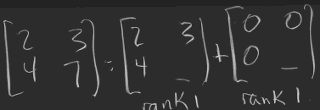
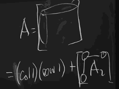
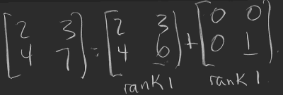
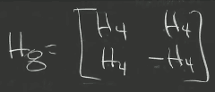
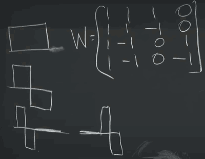

# 1. The Column Space of A Contains All Vectors Ax

```
A =

    2    1    3
    3    1    4
    5    7   12
```

We can easily figure out that the column vectors are dependent. But what's about the row vectors? Can you find out the linear combination which leads to 0 ?

A = CR

```
C =

   2   1
   3   1
   5   7
```

```
R =

   1   0   1
   0   1   1
```

Now we get a basis of the row space , and can easily figure out the linear combination.

## AxB

- beginner way
    - *row of A*  · *col of B*
- deeper way
    - Σ *col of A* x *row of B*
    - sum of rank-1 matrices
    - Quiz: 
    - Idea: 
        - pulling off a rank-1 matrix
        - the rest has 0s in the 1st row and col
    - Ans: 

# 2. Multiplying and Factoring Matrices

- A = LU  , elimination
- A = QR
- S = QΛQᵀ  , symmetric matrix, real eigen values, orthogonal eigen vectors
    - = λ₁·q₁·q₁ᵀ + ... + λ<sub>n</sub>·qλ<sub>n</sub>·qλ<sub>n</sub>ᵀ  (spectral theorem)
    - Sq₁ = λ₁·q₁
- A = XΛX⁻¹  , Not symmetric
- A = UΣVᵀ  ,  A is not square


# 3. Orthonormal Columns in Q Give QᵀQ = I

## Householder Reflections Matrix

- start with a unit vector uᵀu = 1
- H = I - 2uuᵀ
- HᵀH = I - 4uuᵀ + 4uuᵀuuᵀ = I
    - H is orthogonal matrix
    - H is symmetric

## Hadamard Matrix





## Wavelets



self-scaling


Eigenvector of S=Sᵀ , QᵀQ=I are orthogonal.

Eigenvetor of Q = 

```
Q =

   0   1   0   0
   0   0   1   0
   0   0   0   1
   1   0   0   0
```

are 4x4 Fourier Discrete Transform .

Does this work for any Q ?


# 4. Eigenvalues and Eigenvectors

When I say *positive definite*, I mean symmetric.

- if x is a eigenvector of A , then 
    - Aᵏx = λᵏx
    - A⁻¹x = 1/λ · x
- how about any vector v ?
    - split into the linear combination of eigenvectors:
    - v = c₁x₁ + ... + c<sub>n</sub>x<sub>n</sub>
    - Aᵏv = c₁λ₁ᵏx₁ + ... + c<sub>n</sub>λ<sub>n</sub>ᵏx<sub>n</sub>
- solving problems:
    - v<sub>k+1</sub> = Av<sub>k</sub>
    - dv/dt = Av
- similar matrix
    - B = M⁻¹AM
    - A and B have the same eigenvalues
- AB has the same non-zero eigenvalue as BA
    - M=B ,so that B⁻¹(BA)B = AB 


-------

# 复数矩阵

    复数向量求模（长度） 不能使用点积  zᵀz
    而应该使用z的共轭复数  żᴴz
    
    在复数情况下， Aᵀ=A 不再适用
    而是  Aᴴ=A
    
    所以复数情况下，对称矩阵是这样一类矩阵
    
    |2      3+i | 
    |3-i    5   |

主对角线上的元素都是实数，因为主对角线元素共轭后不能变， 其他元素互为 共轭

    同样的，正交矩阵的性质，也变成了 QᴴQ=I   


