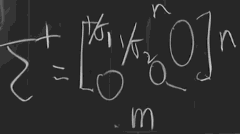
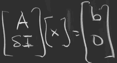

...menustart

 - [9. Four Ways to Solve Least Squares Problems](#cd91567113bfdbbb8c6014e9d4ce56aa)
     - [1. Pseudo Inverse A⁺](#152539916b795b52e222ab4ab2f80411)
     - [Solve AᵀA = Aᵀb](#404da86b1a7f49d3c053d3fb71cde1f8)
     - [3. Orthogonalize first](#f8994b41680b4328f1915bd33e9bbb09)
 - [10. Survey of Difficulties with Ax = b](#c335fe9d2fa388abf174d141554cc33b)

...menuend

<h2 id="cd91567113bfdbbb8c6014e9d4ce56aa"></h2>

# 9. Four Ways to Solve Least Squares Problems

1. Pseudo Inverse A⁺
    - works for any matrix
2. Solve AᵀA = Aᵀb
    - works when A has independent columns
3. Orthogonalize first
    - Gram-Schmidt
4. (AᵀA + δ²I)x = Aᵀb

---

<h2 id="152539916b795b52e222ab4ab2f80411"></h2>

## 1. Pseudo Inverse A⁺

- A mxn, A⁺ nxm
    - x in row space is going to column space, it is invertible
        - what does A⁺ is to take vector in column space back to row space.
        - 
    - x in null space is to (0,0), it is not invertible
        - since A⁺ can only take vector in N(Aᵀ) back to (0,0)
    - A⁺A is identity on the top half, and 0 on the bottom half.

- Now I want a simple formular for it.
    - If we were looking for a nice expression, start with the SVD, 
    - if A is invertible, A⁻¹ = V·1/∑·Uᵀ 
    - if A is not invertible, now ∑ is not invertible,  A⁺ = V·∑⁺·Uᵀ
        - 
        - **x = A⁺b** = V·∑⁺·Uᵀ·b

<h2 id="404da86b1a7f49d3c053d3fb71cde1f8"></h2>

## Solve AᵀA = Aᵀb

- Minimize ‖Ax-b‖² = (Ax-b)ᵀ(Ax-b) = xᵀAᵀAx - 2bᵀAx + bᵀb
    - this is the loss function
- What equation is solved by the best x ?
    - Solution: 
        - if **A has independent columns**, N(A)=0 , then AᵀA is invertible, then
        - AᵀAx̂ = Aᵀb
        - x̂ = (AᵀA)⁻¹Aᵀb
    - most examples, if A is not very big or very difficult, you just create AᵀA and use matlab or octave to solve it quickly.
    - But what if it is difficult to create AᵀA ?  e.g. A has dependent columns.
- What if A has dependent columns ?
    - use A⁺
    - We are going to connect AᵀAx̂ = Aᵀb  to A⁺. 
    - Claim: 
        - A⁺b = (AᵀA)⁻¹Aᵀb  , **when N(A)=0**, i.e. rank=r
        - V∑⁺Uᵀ = (AᵀA)⁻¹Aᵀ

<h2 id="f8994b41680b4328f1915bd33e9bbb09"></h2>

## 3. Orthogonalize first

- the same requirement of N(A)=0.

<h2 id="c335fe9d2fa388abf174d141554cc33b"></h2>

# 10. Survey of Difficulties with Ax = b

0. x = A⁺b , pseudo inverse
    - an answer for all cases
1. x = A⁻¹b
    - good, normal case 
    - size ok, condition σ₁/σn ok ( ratio of min σ and max σ )
    - octave: A\b
2. m > n = ***rank***
    - AᵀAx̂ = Aᵀb
    - A\b still works
3. `m < n`
    - underdetermined case, don't have enough equations, so I have to put something more in to get a specific answer
    - **typical of deep learning**. 
        - There are so many weights in a deep neural network, the weights will be the unknowns, it wouldn't be linear. 
        - we have many solutions, and we have to pick 1, or we would pick an algorithm to find 1. 
        - a good solution means when you apply it to the test data it gives you good result. That's the big question in deep learning: how does an algorithm bias the solution toward that generalizes, that works on test data ? 
    - So we could pick the minimum norm solution, the shortest solution would be the l2 answer. 
        - Or we could go l1. The big question is that does depp learning and the iteration from stochastic gradient descent go to the minimum l1 ?
4. columns in bad condition, nearly dependent
    - Gram-Schmidt  A = QR
    - we can do Gram-Schmidt ways normally , just like in 18.06. 
        - Or do column pivoting.  You allow yourself to reorder them.
5. Nearly singular, singular value is very close to 0
    - Inverse problem. You're in dange, its inverse is gonna be unreasonably big.
    - The world of inverse problems thinks of adding a penalty term.
    - min ‖Ax-b‖₂² + δ²‖x‖₂²    (use l2 norm)
6. Too big
    - Iterative Method: You never get the exact answer, but you get closer and closer.
7. Way too big
    - giant giant matrix, which is happening these days.
    - randomized linear algebra has popped up. The idea is to use probability to sample the matrix, and work with you samples.

## CASE 5: Nearly singular

- The matrix is nearly singular. So you could apply  elimination, but it would give a poor result. 
- So one solution is the SVD.
    - A⁻¹ = VΣ⁻¹Uᵀ
    - But nearly singualr means σ has some very small singular value. And the Σ⁻¹ has some very big singular values. So you're really in wild territory here with very big inverse.
- min ‖Ax-b‖₂² + δ²‖x‖₂²   is a way to regularize the problem.
    - It's going to be a least square with penalty
    - We actually solve the least square problem on a new matrix 
    - 
    - ( AᵀA + δ²I )x = Aᵀb
        - x = ( AᵀA + δ²I )⁻¹Aᵀ
    - when δ → 0, x = A⁺b

# 11. Minimizing _x_ Subject to Ax = b

