# Blender Low Polygon Modeling 

## UI

- Move object
    - G + x/y/z or "middle mouse button"
    - S + shift-x means to scale in y-z plane
- Move world
    - middle mouse botton to orbit
    - shift-middle mouse button to pan
    - (blender 2.8) if you don’t have a middle mouse button, use the hand icon in gizzard mode
- (2.8)Focus on selected object 
    - numpad .
    - or  \` + 3  (2.8 ?)
- Search
    - F3 (blender 2.8)
    - space ( 2.79)
- Vew
    - Numpad 1: front
    - Numpad 3: right
    - Numpad 7: top
    - Numpad 5: orthogonal
    - Humpad 9: user view
- select
    - ring edges :  ALT+SHIFT+ select edge
    - circle select: CTRL+ mouse-left draw
    - switch select mode(vertex/edge/face) CTRL+TAB [+1,2,3]
    - ctrl + `num pad +`  grow the selection
        - for example,  选中鞋底的面，然后 一点一点往上增加选中的面, 直至选中完整的鞋子。
- model
    - subdivide: CTRL+R  [ +mouse wheel ]
        - **You will break the ability to do subdivide if you start making triangles**.
    - cut: k 
    - remove doubles:  editor mode, a to select all, then
        - 
    - inset faces
        - 

- Cursor
    - shift+s / cursor to seledtion

## Mirror

- unselect this 
    - 
- b  boxing select 
- delete vertex 
    - 
- add Mirror modifier
    - ensure the Clipping is checked
    - 

## Head 

- Cube + Subdivison surface modifier  (apply it)
- perform "Mirror"
- select the back bottom face, extract it
    - 
- **Trick** flatten the face: s + z + 0
    - 
- **Trick** if you select snap to vertices
    - 
    - I'm gonna make that face square
    - 
    - g to move a vertex, then hold ctrl,  move vertex along x-axis, and move the cursor the this vertex,  they'll be perfectly aligned now with each other
    - 
    - do the same for the back nect 1
    - 
    - same for the front nect vertex, eventuall we got a perfect square.

## UV

1. obj -> edit mode -> shading / UV tab
2. load texture, a to select a , scale the selector to a reasonable size
3. obj -> N to show property panel -> check "Shading/Textured solid"

## Helm 

1. select faces
2. shift-D to duplicate
3. seprate by select ,  to make a separated object

## Mace

1. cube to create the handle, and then
1. add a Ico sphere for the mace
2. random select face
3. e to extrude , escape,  then scale 
    - 
4. how to modle spikes?
    - use individual pivot point 
    - 
    - and then scale to 0 to make spikes
    - 

## Armature

- check "X-ray" in object panel to see all bone
- 2 bones
    - ctrl P :  connected,  or make offset
        - make offset: 
            - note: order of bone added matters
    - alt P : clear parant , or disconnect bone
- symmetrize Armature
    - search `symmetrize`
    - if you named your bone as `xxx.L` , then the symmetrized bone will be names as `xxx.R`
- one thing is very useful to do is 
    - in edit mode, select all bones, and CTRL-N , select 'View axis'
    - 
    - if in post mode you animate some bone like this
    - 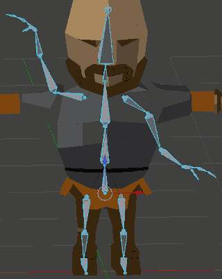
    - and the select all bone, CTRL-C,  SHIFT-CTRL-V, I can perfectly flip x.
    - 
- restore post
    - ALT-G : clear pose location
    - + ALT-R : clear pose rotation
- connect armature and your character
    1. select character (object mode)
    2. shift select bones ( pose mode )
    3. CTRL+P, you can choose "With Automatic Weights".

## Paint Weights

1. pose mode, choose bone
2. select you character, now you are in object mode, change to "Weight Paint"
    - 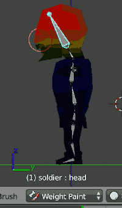
    - since the character is mirrored, and the bone are symmetric, so we just need do weight changs on half side.

## Inverse Kinematics

- bone, edit mode, extrude extra bone.
- ALT-P, clear parent, move to this postion
    - 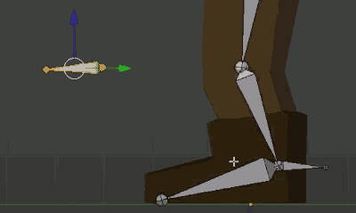
    - this is going to be a bone that the knee is going to be aimed towards at all times
- selec foot bone, SHIFT-A to add a bone , adjust the position
    - 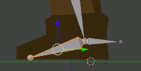
    - 
- symmertized control bones
- select lowerLeg bone, add *bone constrait* -- inverse kinematics
    - 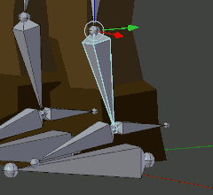
    - 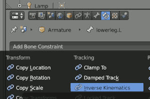
    - change chain length to 2
    - 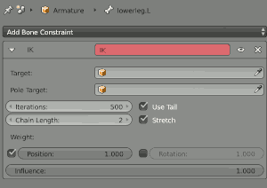
    - set target and pole target
        - 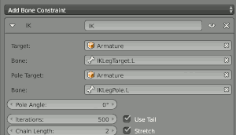
        - target -> Armature , bone -> 脚后跟的控制骨骼
        - pole target -> Armature , bone -> Leg pole 膝盖前方的控制骨骼
    - 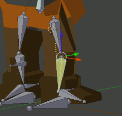
- parent the top 2 bone respectively to the bottom FootControl bone
    - 
    - there is still a problem, foot bone may detach from the LowerLeg bone
    - 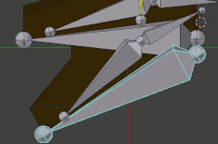
    - so we need to a copy location of foot joint, add constraints *Copy Location*
        - set Target to LowerLeg bone
        - set Bone to LowerLeg
        - set Head/Tail to *Tail*
        - 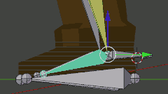
        - 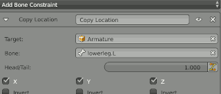
- move the leg control bone upper , 否则膝盖无法抬得很高
    - 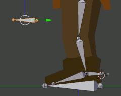

## Animation

- In Animation Editor,  select *Action Edtor* Mode
    - 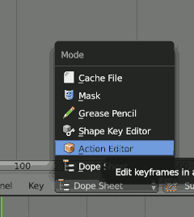
- then click "New" , and name your action
    - this it important you need to click this *F* to save this data-block even if it has no users. So it saves this to the file line. 
    - 
- **Insert Key Frames**
    - in Action Editor
        - select all bones, I ,  for all channel
    - in Scene editor
        - I ,  Loc and Rot
        - 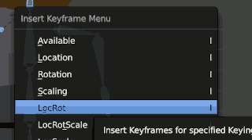
        - 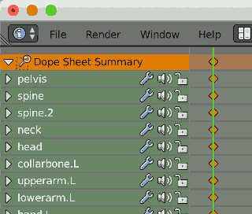
- automatically insert key frames
    - 
- **Copy/Paste** key frame
    1. in action editor , select a frame line
    2. in pose mode editor, select all bone , CTRL-C
    3. back to action editor, select target frame line
    4. **Back 2 Pose Mode** , CTRL-V
- walk tips
    - for the key frames in 2nd half cycle 
    - select any bones which is recorded in the key frames
    - use CTRL-C / SHIFT-CTRL-V to copy

## Attach a weapon

1. select weapon object,  add object constrait *Child Of*
    - 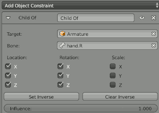
    - we don't want any scale
2. reset the position of weapon to 0,0,0, and adjust the rotaion
    - may need go back to action editor to adjust the weapon position to perfectly grab it.
    - you'd betten to turn *automatically insert key frame* to off.

## Copy Transformation Properties to other weapons

1. select the object you want to transform
2. shift-select the target object
3. click object tab
4. In transformation, right click the Location X/Y/Z property 
5. in the pop-up list, choose *Copy All To Select*
    - 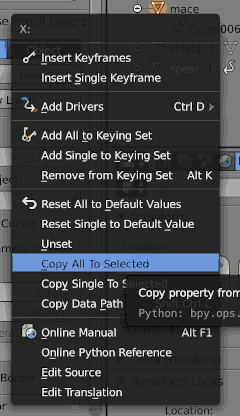
6. do the same for rotaion and scale

