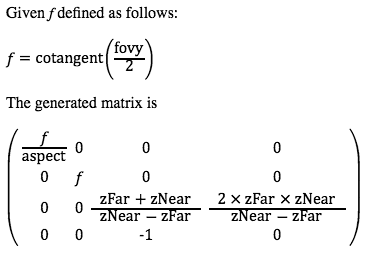

# OpenGL projection matrix


## Perspective


**GLKit**

```oc
void mtxLoadPerspective(float* mtx, float fov, float aspect, float nearZ, float farZ)
{
    float f = 1.0f / tanf( (fov * (M_PI/180)) / 2.0f);
    
    mtx[0] = f / aspect;
    mtx[1] = 0.0f;
    mtx[2] = 0.0f;
    mtx[3] = 0.0f;
    
    mtx[4] = 0.0f;
    mtx[5] = f;
    mtx[6] = 0.0f;
    mtx[7] = 0.0f;
    
    mtx[8] = 0.0f;
    mtx[9] = 0.0f;
    mtx[10] = (farZ+nearZ) / (nearZ-farZ);
    mtx[11] = -1.0f;
    
    mtx[12] = 0.0f;
    mtx[13] = 0.0f;
    mtx[14] = 2 * farZ * nearZ /  (nearZ-farZ);
    mtx[15] = 0.0f;
}

// mtxLoadPerspective(projection , 90 , 2 , 5, 1000 )

// 0.500000,0.000000,0.000000,0.000000
// 0.000000,1.000000,0.000000,0.000000
// 0.000000,0.000000,-1.010050,-10.050251
// 0.000000,0.000000,-1.000000,0.000000


// mtxLoadPerspective(projection , 60 , 2 , 5, 1000 )

// 0.866025,0.000000,0.000000,0.000000
// 0.000000,1.732051,0.000000,0.000000
// 0.000000,0.000000,-1.010050,-10.050251
// 0.000000,0.000000,-1.000000,0.000000
```

[khronos gluPerspective, pls open in safari](https://www.khronos.org/registry/OpenGL-Refpages/gl2.1/xhtml/gluPerspective.xml)

- Parameters
    - fovy:  Specifies the field of view angle, in degrees, in the y direction.
    - aspect:  Specifies the aspect ratio that determines the field of view in the x direction. The aspect ratio is the ratio of x (width) to y (height).
    - zNear: Specifies the distance from the viewer to the near clipping plane (always positive).
    - zFar: Specifies the distance from the viewer to the far clipping plane (always positive).
- In general, the aspect ratio in gluPerspective should match the aspect ratio of the associated viewport. 




## Frustum 

[khronos glFrustum, safari](https://www.khronos.org/registry/OpenGL-Refpages/gl2.1/xhtml/glFrustum.xml)

same as perspective

- Parameters
    - left, right: Specify the coordinates for the left and right vertical clipping planes.
    - bottom, top: Specify the coordinates for the bottom and top horizontal clipping planes.
    - nearVal, farVal: Specify the distances to the near and far depth clipping planes. Both distances must be positive.


[more frustum details](http://www.songho.ca/opengl/gl_projectionmatrix.html)

z in the eye space is always projected to -ZNear on the near plane.

(x<sub>e</sub>,y<sub>e</sub>,z<sub>e</sub>)

will be projected to the near plane

(-n/z<sub>e</sub> · x<sub>e</sub>, -n/z<sub>e</sub> · y<sub>e</sub>, -n)   (PS. this coordinate not normalized in frustum)

x' = x<sub>e</sub>·n/ -z<sub>e</sub>


```
? 0  0   0
0  ?  0   0
0  0  A   B
 0  0  -1  0   // that is w=-z
```

z' = z/w = (A·z + B·1)/w = (A·z + B)/-z

To find the coefficients, A and B,

1. (A·-zn + B)/zn = -1   =>  -A·zn + B = -zn
2. (A·-zf + B)/zf = 1    =>  -A·zf + B = zf

solve this equation:

A = -(zf+zn)/(zf-zn)

B = -2·zf·zn/(zf-zn)


